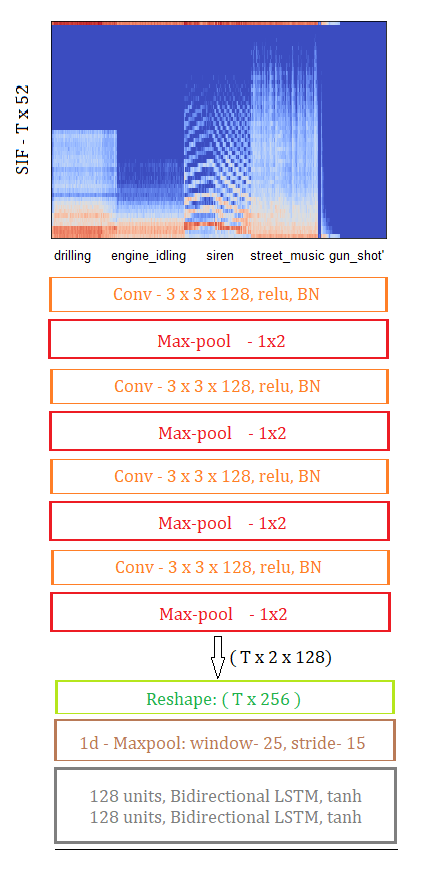

# Audio-Event-Detection
The endsem project for MLSP-2020

Task-1 is the implimentation of the model from [1]. Here the goal is to classify given audio file which contains a single event-class - for example "dog_bark". There are a total of 10 classes we are interested in.

Task-2 is more interesting in the sense that here we detect the sequence of these event-classes. The network which was used is shown in the following figure. We train the network using CTC[2] loss.  

[1] P han, H., Hertel, L., Maaß, M., & Mertins, A. (2016). Robust Audio Event Recognition with 1-Max Pooling Convolutional Neural Networks. I NTERSPEECH.

